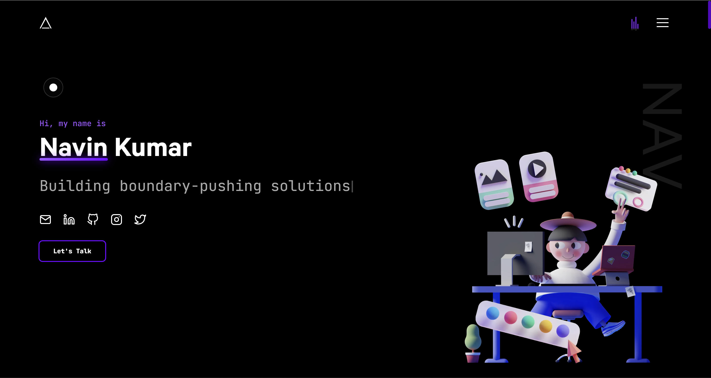

# Portfolio

  
  
  

👨‍🎓 An eye-catching developer Portfolio, Built on NextJS, GSAP, Tailwind and React

### ✨ [Live Demo](http://)

## Table of Contents
- [Getting Started](#getting-started)
- [Design](#design)
- [Features](#features)
- [Contributing](#contributing)

## Getting Started

In the project directory, you can run:

#### `yarn install`

#### `yarn dev`

Runs the app in the development mode.\
Open [`http://localhost:3000`](http://localhost:3000) to view it in the browser.

## Design
The design of this portfolio was inspired by modern web aesthetics, focusing on clean lines, vibrant colors, and responsive layouts. Utilizing **Tailwind CSS** allowed for rapid prototyping and customization, ensuring a unique look and feel. The animations powered by **GSAP** enhance user engagement, making the browsing experience more dynamic and enjoyable.

## Features
- **Responsive Design**: The portfolio is fully responsive, ensuring a seamless experience across devices.
- **Dynamic Animations**: Enhanced user engagement through smooth animations powered by GSAP.
- **Modern Aesthetics**: A clean and modern design using Tailwind CSS for styling.
- **Easy Navigation**: Intuitive navigation structure for easy access to different sections of the portfolio.
- **Live Demo**: A live demo link to showcase the portfolio in action.

## Contributing

If you'd like to contribute to this project, please fork the repository and create a pull request. Your contributions are welcome!
